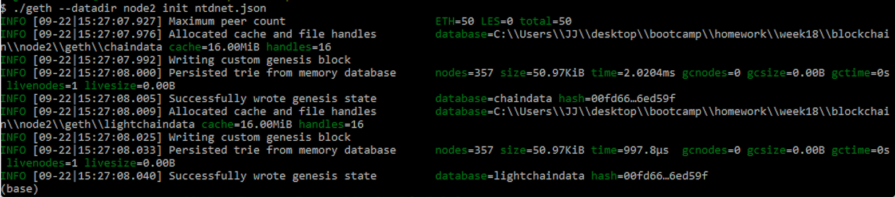
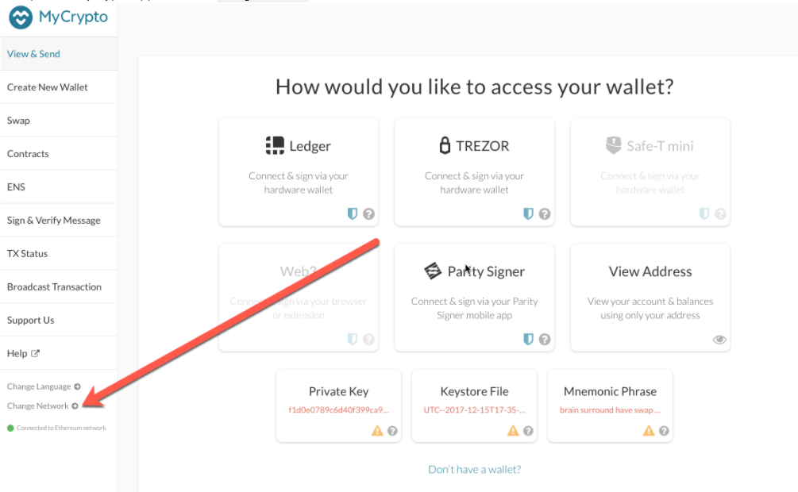

# Building-the-Blockchain
Blockchain Case Study and POA Development Chain

## Running a Proof of Authority Blockchain

### 1. Create accounts for two nodes for the network with a separate datadir for each using geth.

* ./geth --datadir node1 account new
* ./geth --datadir node2 account new

Node 1's key: 0x9b719f81030F5B2b056065E7cd13958C810D13FD

Node 2's key: 0x0127f9036fE57a219cF5d825099EC64B403dB8F9

### 2. Next, generate your genesis block.

* Run puppeth, name your network, and select the option to configure a new genesis block.

#### *In this case the name of network is **ntdnet***
#### *Chain ID is **888***

* Choose the Clique (Proof of Authority) consensus algorithm.

* Paste both account addresses from the first step one at a time into the list of accounts to seal.

* Paste them again in the list of accounts to pre-fund. There are no block rewards in PoA, so you'll need to pre-fund.

* Complete the rest of the prompts, and when you are back at the main menu, choose the "Manage existing genesis" option.

* Export genesis configurations. This will fail to create two of the files, but you only need networkname.json.

### 3. With the genesis block creation completed, we will now initialize the nodes with the genesis' json file.

Using geth, initialize each node with the new networkname.json.

* ./geth --datadir node1 init networkname.json
* ./geth --datadir node2 init networkname.json

### 4. Now the nodes can be used to begin mining blocks.
Run the nodes in separate terminal windows with the commands:

* ./geth --datadir node1 --unlock "SEALER_ONE_ADDRESS" --mine --rpc --allow-insecure-unlock
* ./geth --datadir node2 --unlock "SEALER_TWO_ADDRESS" --mine --port 30304 --bootnodes "enode://SEALER_ONE_ENODE_ADDRESS@127.0.0.1:30303" --ipcdisable --allow-insecure-unlock

In this case:
* ./geth --datadir node1 --unlock "9b719f81030F5B2b056065E7cd13958C810D13FD" --mine --rpc --allow-insecure-unlock
* ./geth --datadir node2 --unlock "0127f9036fE57a219cF5d825099EC64B403dB8F9" --mine --port 30304 --bootnodes "enode://364dbff49557465f412a59da9adeeab3195956ca1ee86a18dfaf9a7e93343a668c7424f157d53d858a054e7968962a4234cf35d8d58e0e452ec9e58737363b45@127.0.0.1:30303" --ipcdisable --allow-insecure-unlock

NOTE: Type your password and hit enter - even if you can't see it visually!

### 5. Your private PoA blockchain should now be running!

### 6. With both nodes up and running, the blockchain can be added to MyCrypto for testing.

* Open the MyCrypto app, then click Change Network at the bottom left:

* Click "Add Custom Node", then add the custom network information that you set in the genesis.

* Make sure that you scroll down to choose Custom in the "Network" column to reveal more options like Chain ID

* Type ETH in the Currency box.

* In the Chain ID box, type the chain id you generated during genesis creation. In this case is 888

* In the URL box type: http://127.0.0.1:8545.  This points to the default RPC port on your local machine.

* Finally, click Save & Use Custom Node.

### 7. After connecting to the custom network in MyCrypto, it can be tested by sending money between accounts.

On the next screen, click Select Wallet File, then navigate to the keystore directory inside your Node1 directory, select the file located there, provide your password when prompted and then click Unlock.

This will open your account wallet inside MyCrypto.

In the To Address box, type the account address from Node2, then fill in an arbitrary amount of ETH:

Confirm the transaction by clicking "Send Transaction", and the "Send" button in the pop-up window.

Click the Check TX Status when the green message pops up, confirm the logout:

